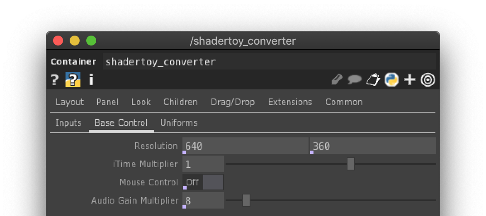
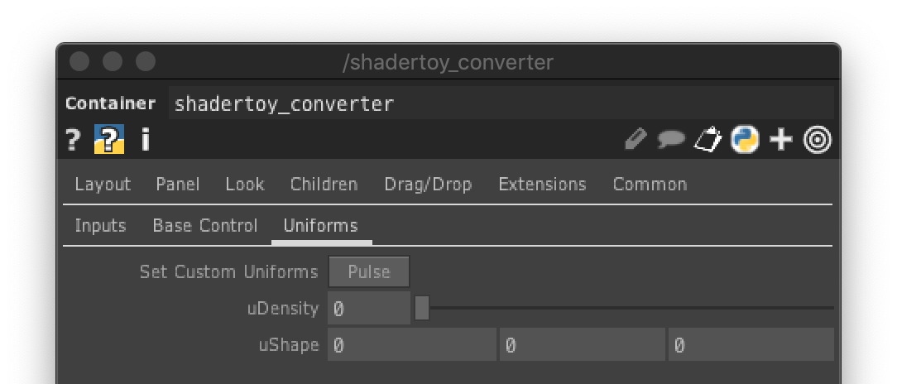
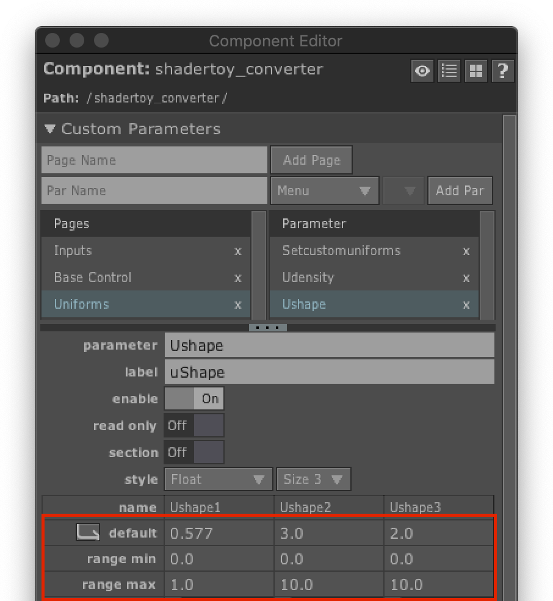

# Shadertoy Converter

This converter is for taking shader code (ie. super slick glsl graphics) from [ShaderToy](www.shadertoy.com) and converting it for use in [TouchDesigner](www.derivative.ca) and setting up control to interact with parameters that affect the graphics. The .tox component has 6 inputs. The first input is the shader code DAT. The second input is for an audio CHOP. The remaining four are TOP inputs. These inputs can be 2D textures or cubemaps. 

### The .tox component has 3 pages of custom parameters:

1. The first page sets the iChannel[0-3] inputs, which you can choose 2D Texture, Cubemap or Audio. Set these according to what the shadertoy source had as their iChannel inputs. 

2. The second page sets the resolution of the output, has an adjustment for the speed of iTime, turns off/on mouse control (which the mouse interactivity happens within the TD window) and adjusts the gain for the audio inputs.

3. The third page is for the custom uniforms you add to the shader:
   
   a. Add a Text DAT, right-click on it and select "Edit Contents in Textport" and paste the shader code inside the textport.
   
   
   b. Define whatever uniforms you want in the code. The formatting needs to be: `uniform <type> uName;`
   
   
   c. Add the uniforms wherever you want
   
   
   d. Connect the Text DAT to the first input
   
   
   e. On the third page of the Shadertoy Converter, click "Set Custom Uniforms"
   
   
   f. Now you can see the uniforms are set and ready to be used
   
   
   g. To adjust the default value and range, first right click on the Shadertoy Converter and select "Customize Component..."
   
   
   h. Then set the default and range values
   
   
   i. You can close the window and now see that everything is setup
   
   
The component comes embedded with this shader: https://www.shadertoy.com/view/MtXSD7, audio and a cubemap, so it works right away.
